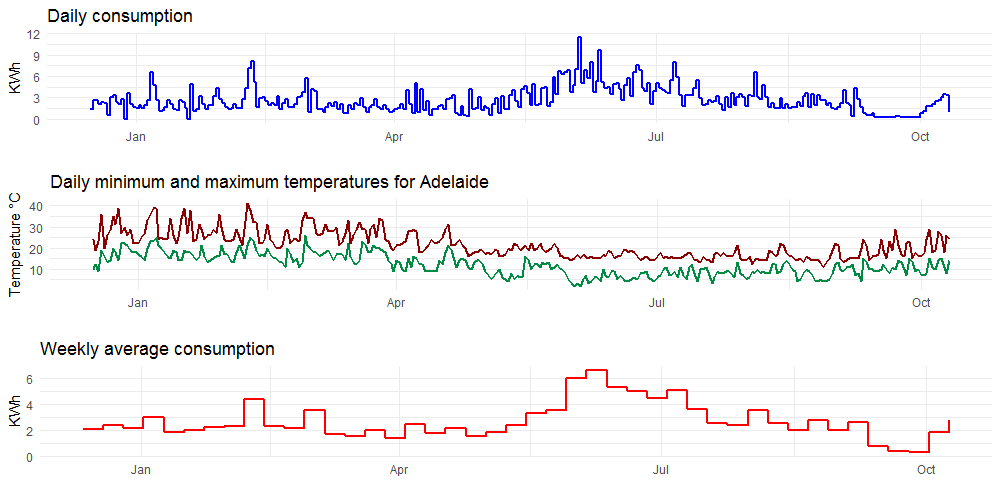

## Analysing daily power usage data for my house

Ever since my landlord installed a power meter in my studio unit, I have been recording daily usage on a Google docs spreadsheet. This is the code I use to check usage stats and compare usage patterns with weather data.

## Data
Daily readings from power meter was entered into a Google docs spreadsheet (Google Sheets). There are two dates with no data due to blackout. Past weather data was obtained using weatherData R package. Sign-in using a Google account is required to access Google docs spreadsheet.

## R packages used
* tidyverse
* googlesheets
* weatherData

## Screenshots


<small>Usage graph</small>

## Code

```r
library(googlesheets)
library(tidyverse)
library(weatherData)
require(gridExtra)
require(zoo)
gs_auth()
mdata <- gs_url("https://docs.google.com/spreadsheets/###################")
reading <- mdata %>%
  gs_read(ws = 1)
reading$Date2 <- as.Date(reading$Date, "%d %B %Y")
reading <- reading[complete.cases(reading), ]
#get weather data using weatherData package.
# Unfortunately, this stopped working since October 2017, check the workaround
# code using rwunderground package below
wdata <- getWeatherForDate("ADL", reading$Date2[1], end_date=reading$Date2[nrow(reading)])
reading$max <- wdata[, 2]
reading$min <- wdata[, 4]
#workaround using rwunderground package
library(rwunderground)
#this requires an API key, free tier should be enough
rwunderground::set_api_key("###API KEY###")
weather.hourly <- history_range(set_location(city="Adelaide"),
  date_start = reading$Date2[1],
  date_end = reading$Date2[nrow(reading)],
  use_metric = TRUE)
weather.hourly$day <- as.character(strptime(weather.hourly$date, "%Y-%m-%d"))
weather.daily <- weather.hourly %>%
  group_by(day) %>%
  summarise(daymax=max(temp, na.rm=TRUE),
            daymin = min(temp, na.rm = TRUE))
reading$max <- weather.daily$daymax
reading$min <- weather.daily$daymin
#get running mean
reading$rmean <- rollmean(reading$Consumed, 7, fill=NA)
reading$Week <- format(reading$Date2, "%U")
reading$Year <- format(reading$Date2, "%Y")
reading.weekly <- reading %>%
  group_by(Year, Week) %>%
  summarise(weeklymean=mean(Consumed, na.rm=TRUE))
reading.weekly$Date <- as.Date(paste(reading.weekly$Year,
  reading.weekly$Week, 1, sep="-"),
  "%Y-%U-%u")
```

Plotting:
```r
plot1 <- ggplot(data = reading) +
  geom_line(mapping = aes(x=Date2, y=max), colour="red4", size=1) +
  geom_line(mapping = aes(x=Date2, y=min), colour="springgreen4", size=1) +
  xlab("") + ylab("Temperature °C") +
  ggtitle("Daily minimum and maximum temperatures for Adelaide") +
  theme_minimal()
plot2 <- ggplot(data=reading.weekly) +
  geom_step(mapping = aes(x= Date, y=weeklymean), size=1, direction = "hv", colour="red") +
  xlab("") + ylab("KWh") +
  ggtitle("Weekly average consumption") +
  theme_minimal()
plot3 <- ggplot(data=reading) +
  geom_step(mapping = aes(x= Date2, y=Consumed), size=1, direction = "hv", colour="blue") +
  xlab("") + ylab("KWh") +
  ggtitle("Daily consumption") +
  theme_minimal()
grid.arrange(plot3, plot1, plot2, nrow=3)
```

## License:

Code distributed under the terms of the [MIT license](https://github.com/asheshwor/power-usage/blob/master/LICENSE).

See individual licenses for external data/tools used if any.
